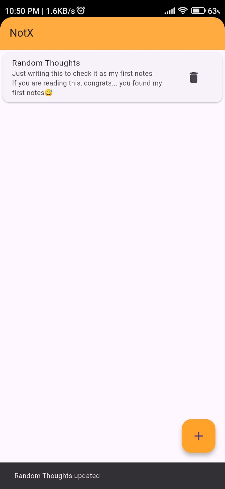

# 📱 NotX – A Simple Notes App in Flutter

NotX is a minimal and fast notes application built using **Flutter** with **Hive** as a local database.  
It is currently in the *CRUD* stage and will be upgraded step by step with more powerful features.

This project is part of my journey to strengthen my Flutter skills and understand efficient local data storage.

---

## 🚀 Features (Current)
- ✍️ Create notes  
- 📖 Read notes  
- ✏️ Update notes  
- 🗑️ Delete notes  
- ⚡ Fast local storage using Hive  
- 🎨 Clean and simple UI  

---

## 🛠 Tech Stack
- **Flutter** – App framework  
- **Dart** – Programming language  
- **Hive** – Lightweight & blazing-fast local database  

---

## 🔮 Upcoming Features
- 🎨 Background customization (themes & colors)  
- 🎙️ Voice notes support  
- 🖼 UI personalization  
- 🔍 Search and filter notes  
- ☁️ Optional cloud backup  

---

## 📸 Screenshots

